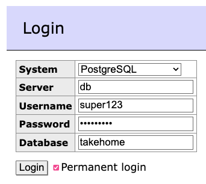

# claim-process-test

Take home coding test.

Trying something new by adapting a
[quasi-standard four layer architecture](https://github.com/nludban/pyramids-python-architecture)
to FastAPI based microservices using docker compose...

Note it's a mono-repo with multiple microservices running inside backend_exe.main...


## Build

```docker build . -f backend_exe/Dockerfile -t takehome/claims_process:0.0.1```


## Run

```docker-compose  -f docker-compose.yml up```

[ ] Create and use separate DB credentials for application.


## Web Access

http://localhost:8080/ -- claim_process API

http://localhost:8081/ -- adminer DB UI (see settings below)




## Requirements

### Claim Process (service)

- [x] Generate a unique ID
- [x] Calculate net fee (provider fee + coinsurance + copay - allowed)
- [-] Send net fee to Payments service
  - [-] Recover on failure


### Payments (service)

- [ ] Record net fee for a claim
- [ ] Top 10 NPIs by net fees
  - [ ] rate limit
  - [ ] optimze
    - SUM() + Group By?
    - Index?
    - Duplicate NPI in Payments?
    - View?


## Schema

### Example Input

| CSV Column          | Example      | Format
| ------------------- | ------------ | ------
| service date        | 3/28/18 0:00 | m/dd/yy 0:00
| submitted procedure | D4346        | "D" + text
| quadrant            | UR           | (optional)
| Plan/Group #        | GRP-1000     | text
| Subscriber#         | 3730189502   | digits
| Provider NPI        | 1497775530   | National Provider Identifier (10 digits)
| provider fees       | $178.00      | USD
| Allowed fees        | $178.00      | USD
| member coinsurance  | $35.60       | USD
| member copay        | $0.00        | USD


### [x] Claims (table)

- Claim ID
- Service Date
- Submitted Procedure ([ ] validated)
- Quadrant (optional)
- Plan Group Number
- Subscriber Number
- Provider NPI ([ ] validated)
- Provider Fees
- Allowed Fees
- Coinsurance
- Copay

Unique: NPI, group, subscriber, date, procedure.


### [x] Payments (table)

- Claim ID (foreign key)
- Net Fee

Unique: claim id.
